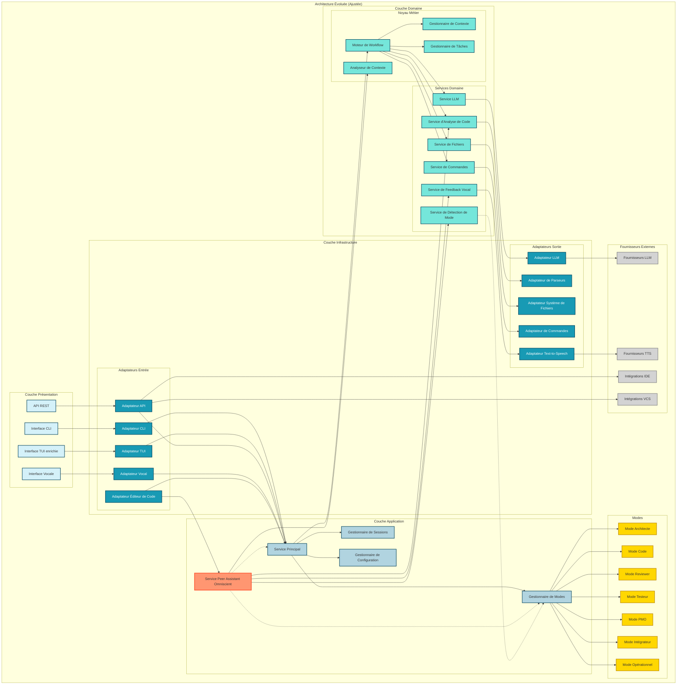

```mermaid
flowchart TB
    subgraph "Architecture Évoluée (Ajustée)"
        subgraph "Couche Présentation"
            CLI["Interface CLI"]
            TUI["Interface TUI enrichie"]
            API["API REST"]
            VoiceInterface["Interface Vocale"]
        end

        subgraph "Couche Application"
            CoreService["Service Principal"]
            PluginManager["Gestionnaire de Modes"]
            SessionManager["Gestionnaire de Sessions"]
            ConfigManager["Gestionnaire de Configuration"]
            
            %% Nouveau service transversal
            PeerAssistantService["Service Peer Assistant Omniscient"]
        end

        subgraph "Couche Domaine"
            subgraph "Noyau Métier"
                WorkflowEngine["Moteur de Workflow"]
                ContextManager["Gestionnaire de Contexte"]
                TaskManager["Gestionnaire de Tâches"]
                ContextAnalyzer["Analyseur de Contexte"]
            end
            
            subgraph "Services Domaine"
                LLMService["Service LLM"]
                CodeAnalysisService["Service d'Analyse de Code"]
                FileService["Service de Fichiers"]
                CommandService["Service de Commandes"]
                VoiceFeedbackService["Service de Feedback Vocal"]
                ModeDetectionService["Service de Détection de Mode"]
            end
        end

        subgraph "Couche Infrastructure"
            subgraph "Adaptateurs Entrée"
                CLIAdapter["Adaptateur CLI"]
                TUIAdapter["Adaptateur TUI"]
                APIAdapter["Adaptateur API"]
                VoiceAdapter["Adaptateur Vocal"]
                CodeEditorAdapter["Adaptateur Éditeur de Code"]
            end
            
            subgraph "Adaptateurs Sortie"
                LLMAdapter["Adaptateur LLM"]
                FileSystemAdapter["Adaptateur Système de Fichiers"]
                CommandAdapter["Adaptateur de Commandes"]
                TTSAdapter["Adaptateur Text-to-Speech"]
                ParserAdapter["Adaptateur de Parseurs"]
            end
        end

        subgraph "Modes"
            ArchitectMode["Mode Architecte"]
            CodeMode["Mode Code"]
            ReviewerMode["Mode Reviewer"]
            TesterMode["Mode Testeur"]
            PMOMode["Mode PMO"]
            IntegratorMode["Mode Intégrateur"]
            OperationalMode["Mode Opérationnel"]
        end

        subgraph "Fournisseurs Externes"
            LLMProviders["Fournisseurs LLM"]
            TTSProviders["Fournisseurs TTS"]
            IDEIntegrations["Intégrations IDE"]
            VCSIntegrations["Intégrations VCS"]
        end
    end

    %% Connexions entre les couches
    CLI --> CLIAdapter
    TUI --> TUIAdapter
    API --> APIAdapter
    VoiceInterface --> VoiceAdapter

    CLIAdapter --> CoreService
    TUIAdapter --> CoreService
    APIAdapter --> CoreService
    VoiceAdapter --> CoreService
    CodeEditorAdapter --> CoreService & PeerAssistantService

    CoreService --> PluginManager
    CoreService --> SessionManager
    CoreService --> ConfigManager
    CoreService --> WorkflowEngine
    
    %% Connexions du service Peer Assistant
    PeerAssistantService --> ContextAnalyzer
    PeerAssistantService --> CodeAnalysisService
    PeerAssistantService --> VoiceFeedbackService
    PeerAssistantService --> ModeDetectionService
    PeerAssistantService -.-> CoreService
    PeerAssistantService -.-> PluginManager

    %% Le service de détection de mode influence le gestionnaire de modes
    ModeDetectionService -.-> PluginManager

    PluginManager --> ArchitectMode & CodeMode & ReviewerMode & TesterMode & PMOMode & IntegratorMode & OperationalMode

    WorkflowEngine --> ContextManager
    WorkflowEngine --> TaskManager
    WorkflowEngine --> LLMService & CodeAnalysisService & FileService & CommandService

    LLMService --> LLMAdapter
    CodeAnalysisService --> ParserAdapter
    FileService --> FileSystemAdapter
    CommandService --> CommandAdapter
    VoiceFeedbackService --> TTSAdapter

    LLMAdapter --> LLMProviders
    TTSAdapter --> TTSProviders
    APIAdapter --> IDEIntegrations & VCSIntegrations

    %% Styles
    classDef presentation fill:#D4F1F9,stroke:#05445E,stroke-width:2px
    classDef application fill:#B1D4E0,stroke:#05445E,stroke-width:2px
    classDef domain fill:#75E6DA,stroke:#05445E,stroke-width:2px
    classDef infrastructure fill:#189AB4,stroke:#05445E,stroke-width:2px,color:white
    classDef modes fill:#FFD700,stroke:#B8860B,stroke-width:2px
    classDef external fill:#D3D3D3,stroke:#808080,stroke-width:2px
    classDef peerassistant fill:#FF9671,stroke:#FF5733,stroke-width:3px

    class CLI,TUI,API,VoiceInterface presentation
    class CoreService,PluginManager,SessionManager,ConfigManager application
    class PeerAssistantService peerassistant
    class WorkflowEngine,ContextManager,TaskManager,ContextAnalyzer,LLMService,CodeAnalysisService,FileService,CommandService,VoiceFeedbackService,ModeDetectionService domain
    class CLIAdapter,TUIAdapter,APIAdapter,VoiceAdapter,CodeEditorAdapter,LLMAdapter,FileSystemAdapter,CommandAdapter,TTSAdapter,ParserAdapter infrastructure
    class ArchitectMode,CodeMode,ReviewerMode,TesterMode,PMOMode,IntegratorMode,OperationalMode modes
    class LLMProviders,TTSProviders,IDEIntegrations,VCSIntegrations external
```
