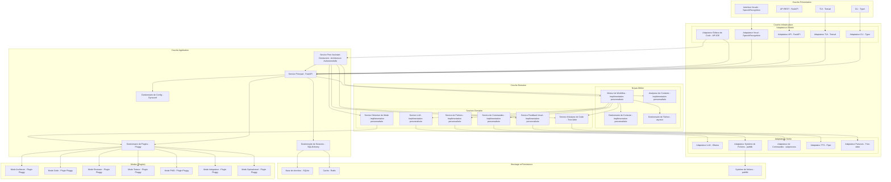

```mermaid
flowchart TB
    subgraph "Couche Présentation"
        CLI[CLI - Typer]
        TUI[TUI - Textual]
        API[API REST - FastAPI]
        Voice[Interface Vocale - SpeechRecognition]
    end

    subgraph "Couche Application"
        CoreService[Service Principal - FastAPI]
        PluginManager[Gestionnaire de Plugins - Pluggy]
        SessionManager[Gestionnaire de Sessions - SQLAlchemy]
        ConfigManager[Gestionnaire de Config - Dynaconf]
        PeerAssistant[Service Peer Assistant Omniscient - Architecture événementielle]
    end

    subgraph "Couche Domaine"
        subgraph "Noyau Métier"
            WorkflowEngine[Moteur de Workflow - Implémentation personnalisée]
            ContextManager[Gestionnaire de Contexte - Implémentation personnalisée]
            TaskManager[Gestionnaire de Tâches - asyncio]
            ContextAnalyzer[Analyseur de Contexte - Implémentation personnalisée]
        end
        
        subgraph "Services Domaine"
            LLMService[Service LLM - Implémentation personnalisée]
            CodeAnalysis[Service d'Analyse de Code - Tree-sitter]
            FileService[Service de Fichiers - Implémentation personnalisée]
            CommandService[Service de Commandes - Implémentation personnalisée]
            VoiceFeedback[Service Feedback Vocal - Implémentation personnalisée]
            ModeDetection[Service Détection de Mode - Implémentation personnalisée]
        end
    end

    subgraph "Couche Infrastructure"
        subgraph "Adaptateurs Entrée"
            CLIAdapter[Adaptateur CLI - Typer]
            TUIAdapter[Adaptateur TUI - Textual]
            APIAdapter[Adaptateur API - FastAPI]
            VoiceAdapter[Adaptateur Vocal - SpeechRecognition]
            CodeEditorAdapter[Adaptateur Éditeur de Code - API IDE]
        end
        
        subgraph "Adaptateurs Sortie"
            LLMAdapter[Adaptateur LLM - Ollama]
            FileAdapter[Adaptateur Système de Fichiers - pathlib]
            CommandAdapter[Adaptateur de Commandes - subprocess]
            TTSAdapter[Adaptateur TTS - Piper]
            ParserAdapter[Adaptateur Parseurs - Tree-sitter]
        end
    end

    subgraph "Modes (Plugins)"
        ArchitectMode[Mode Architecte - Plugin Pluggy]
        CodeMode[Mode Code - Plugin Pluggy]
        ReviewerMode[Mode Reviewer - Plugin Pluggy]
        TesterMode[Mode Testeur - Plugin Pluggy]
        PMOMode[Mode PMO - Plugin Pluggy]
        IntegratorMode[Mode Intégrateur - Plugin Pluggy]
        OperationalMode[Mode Opérationnel - Plugin Pluggy]
    end

    subgraph "Stockage et Persistance"
        DB[Base de données - SQLite]
        Cache[Cache - Redis]
        Filesystem[Système de fichiers - pathlib]
    end

    %% Connexions entre couches
    CLI --> CLIAdapter
    TUI --> TUIAdapter
    API --> APIAdapter
    Voice --> VoiceAdapter
    
    CLIAdapter --> CoreService
    TUIAdapter --> CoreService
    APIAdapter --> CoreService
    VoiceAdapter --> CoreService
    CodeEditorAdapter --> CoreService
    CodeEditorAdapter --> PeerAssistant
    
    CoreService --> WorkflowEngine
    CoreService --> PluginManager
    CoreService --> SessionManager
    CoreService --> ConfigManager
    
    PeerAssistant --> ContextAnalyzer
    PeerAssistant --> CodeAnalysis
    PeerAssistant --> VoiceFeedback
    PeerAssistant --> ModeDetection
    PeerAssistant --> CoreService
    
    ModeDetection --> PluginManager
    
    PluginManager --> ArchitectMode
    PluginManager --> CodeMode
    PluginManager --> ReviewerMode
    PluginManager --> TesterMode
    PluginManager --> PMOMode
    PluginManager --> IntegratorMode
    PluginManager --> OperationalMode
    
    WorkflowEngine --> ContextManager
    WorkflowEngine --> TaskManager
    WorkflowEngine --> LLMService
    WorkflowEngine --> CodeAnalysis
    WorkflowEngine --> FileService
    WorkflowEngine --> CommandService
    
    LLMService --> LLMAdapter
    CodeAnalysis --> ParserAdapter
    FileService --> FileAdapter
    CommandService --> CommandAdapter
    VoiceFeedback --> TTSAdapter
    
    SessionManager --> DB
    SessionManager --> Cache
    FileAdapter --> Filesystem
```
