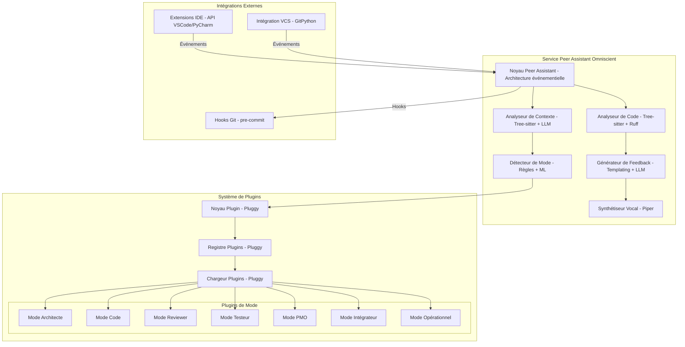

```mermaid
flowchart TB
    subgraph "Service Peer Assistant Omniscient"
        PeerCore[Noyau Peer Assistant - Architecture événementielle]
        ContextAnalyzer[Analyseur de Contexte - Tree-sitter + LLM]
        ModeDetector[Détecteur de Mode - Règles + ML]
        CodeAnalyzer[Analyseur de Code - Tree-sitter + Ruff]
        FeedbackGen[Générateur de Feedback - Templating + LLM]
        VoiceSynth[Synthétiseur Vocal - Piper]
    end
    
    subgraph "Intégrations Externes"
        IDEExt[Extensions IDE - API VSCode/PyCharm]
        VCSInt[Intégration VCS - GitPython]
        PreCommit[Hooks Git - pre-commit]
    end
    
    subgraph "Système de Plugins"
        PluginCore[Noyau Plugin - Pluggy]
        PluginRegistry[Registre Plugins - Pluggy]
        PluginLoader[Chargeur Plugins - Pluggy]
        
        subgraph "Plugins de Mode"
            Architect[Mode Architecte]
            Coder[Mode Code]
            Reviewer[Mode Reviewer]
            Tester[Mode Testeur]
            PMO[Mode PMO]
            Integrator[Mode Intégrateur]
            Operational[Mode Opérationnel]
        end
    end
    
    %% Connexions
    IDEExt -->|Événements| PeerCore
    VCSInt -->|Événements| PeerCore
    
    PeerCore --> ContextAnalyzer
    PeerCore --> CodeAnalyzer
    
    ContextAnalyzer --> ModeDetector
    CodeAnalyzer --> FeedbackGen
    
    ModeDetector --> PluginCore
    PluginCore --> PluginRegistry
    PluginRegistry --> PluginLoader
    
    PluginLoader --> Architect
    PluginLoader --> Coder
    PluginLoader --> Reviewer
    PluginLoader --> Tester
    PluginLoader --> PMO
    PluginLoader --> Integrator
    PluginLoader --> Operational
    
    FeedbackGen --> VoiceSynth
    
    PeerCore -->|Hooks| PreCommit
```
