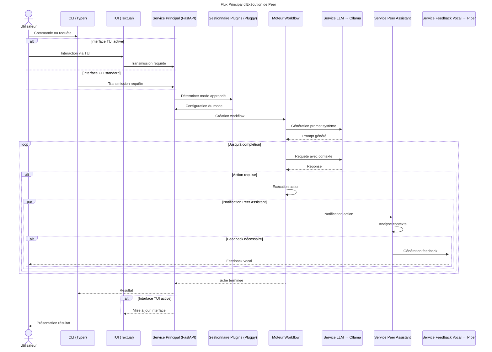
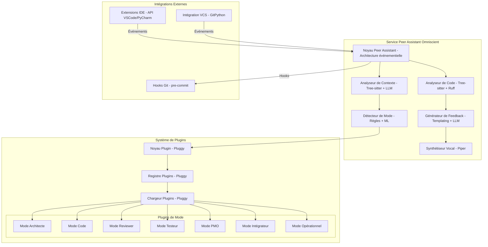

# Plan d'Architecture Globale de Peer

Ce document présente l'architecture globale de Peer, l'assistant de développement omniscient avec feedback vocal. Il intègre les schémas d'architecture, les flux d'exécution et les décisions technologiques pour chaque composant.

## 1. Architecture Globale

Ce schéma présente la vue d'ensemble de toutes les couches et composants de Peer, avec les technologies associées à chacun.

```mermaid
flowchart TB
    subgraph "Couche Présentation"
        CLI[CLI - Typer]
        TUI[TUI - Textual]
        API[API REST - FastAPI]
        Voice[Interface Vocale - SpeechRecognition]
    end

    subgraph "Couche Application"
        CoreService[Service Principal - FastAPI]
        PluginManager[Gestionnaire de Plugins - Pluggy]
        SessionManager[Gestionnaire de Sessions - SQLAlchemy]
        ConfigManager[Gestionnaire de Config - Dynaconf]
        PeerAssistant[Service Peer Assistant Omniscient - Architecture événementielle]
    end

    subgraph "Couche Domaine"
        subgraph "Noyau Métier"
            WorkflowEngine[Moteur de Workflow - Implémentation personnalisée]
            ContextManager[Gestionnaire de Contexte - Implémentation personnalisée]
            TaskManager[Gestionnaire de Tâches - asyncio]
            ContextAnalyzer[Analyseur de Contexte - Implémentation personnalisée]
        end
        
        subgraph "Services Domaine"
            LLMService[Service LLM - Implémentation personnalisée]
            CodeAnalysis[Service d'Analyse de Code - Tree-sitter]
            FileService[Service de Fichiers - Implémentation personnalisée]
            CommandService[Service de Commandes - Implémentation personnalisée]
            VoiceFeedback[Service Feedback Vocal - Implémentation personnalisée]
            ModeDetection[Service Détection de Mode - Implémentation personnalisée]
        end
    end

    subgraph "Couche Infrastructure"
        subgraph "Adaptateurs Entrée"
            CLIAdapter[Adaptateur CLI - Typer]
            TUIAdapter[Adaptateur TUI - Textual]
            APIAdapter[Adaptateur API - FastAPI]
            VoiceAdapter[Adaptateur Vocal - SpeechRecognition]
            CodeEditorAdapter[Adaptateur Éditeur de Code - API IDE]
        end
        
        subgraph "Adaptateurs Sortie"
            LLMAdapter[Adaptateur LLM - Ollama]
            FileAdapter[Adaptateur Système de Fichiers - pathlib]
            CommandAdapter[Adaptateur de Commandes - subprocess]
            TTSAdapter[Adaptateur TTS - Piper]
            ParserAdapter[Adaptateur Parseurs - Tree-sitter]
        end
    end

    subgraph "Modes (Plugins)"
        ArchitectMode[Mode Architecte - Plugin Pluggy]
        CodeMode[Mode Code - Plugin Pluggy]
        ReviewerMode[Mode Reviewer - Plugin Pluggy]
        TesterMode[Mode Testeur - Plugin Pluggy]
        PMOMode[Mode PMO - Plugin Pluggy]
        IntegratorMode[Mode Intégrateur - Plugin Pluggy]
        OperationalMode[Mode Opérationnel - Plugin Pluggy]
    end

    subgraph "Stockage et Persistance"
        DB[Base de données - SQLite]
        Cache[Cache - Redis]
        Filesystem[Système de fichiers - pathlib]
    end

    %% Connexions entre couches
    CLI --> CLIAdapter
    TUI --> TUIAdapter
    API --> APIAdapter
    Voice --> VoiceAdapter
    
    CLIAdapter --> CoreService
    TUIAdapter --> CoreService
    APIAdapter --> CoreService
    VoiceAdapter --> CoreService
    CodeEditorAdapter --> CoreService
    CodeEditorAdapter --> PeerAssistant
    
    CoreService --> WorkflowEngine
    CoreService --> PluginManager
    CoreService --> SessionManager
    CoreService --> ConfigManager
    
    PeerAssistant --> ContextAnalyzer
    PeerAssistant --> CodeAnalysis
    PeerAssistant --> VoiceFeedback
    PeerAssistant --> ModeDetection
    PeerAssistant --> CoreService
    
    ModeDetection --> PluginManager
    
    PluginManager --> ArchitectMode
    PluginManager --> CodeMode
    PluginManager --> ReviewerMode
    PluginManager --> TesterMode
    PluginManager --> PMOMode
    PluginManager --> IntegratorMode
    PluginManager --> OperationalMode
    
    WorkflowEngine --> ContextManager
    WorkflowEngine --> TaskManager
    WorkflowEngine --> LLMService
    WorkflowEngine --> CodeAnalysis
    WorkflowEngine --> FileService
    WorkflowEngine --> CommandService
    
    LLMService --> LLMAdapter
    CodeAnalysis --> ParserAdapter
    FileService --> FileAdapter
    CommandService --> CommandAdapter
    VoiceFeedback --> TTSAdapter
    
    SessionManager --> DB
    SessionManager --> Cache
    FileAdapter --> Filesystem
```

## 2. Flux Principal d'Exécution

Ce diagramme de séquence illustre le flux principal d'exécution de Peer, montrant les interactions entre les différents composants et les technologies utilisées.

## 3. Architecture du Service Peer Assistant et Système de Plugins

Ce schéma détaille l'architecture du Service Peer Assistant Omniscient et du système de plugins, qui constituent le cœur de l'intelligence de Peer.

## 4. Décisions Technologiques par Couche

### 4.1 Couche Présentation
- **CLI** : Typer (0.9.0)
- **TUI** : Textual (0.52.1)
- **API REST** : FastAPI (0.110.0)
- **Interface Vocale** : SpeechRecognition (3.10.0)

### 4.2 Couche Application
- **Service Principal** : FastAPI (0.110.0)
- **Gestionnaire de Plugins** : Pluggy (1.5.0)
- **Gestionnaire de Sessions** : SQLAlchemy (2.0.25)
- **Gestionnaire de Configuration** : Dynaconf (3.2.4)
- **Service Peer Assistant** : Architecture événementielle personnalisée

### 4.3 Couche Domaine
- **Moteur de Workflow** : Implémentation personnalisée
- **Gestionnaire de Contexte** : Implémentation personnalisée
- **Gestionnaire de Tâches** : asyncio (Python 3.11+)
- **Analyseur de Contexte** : Implémentation personnalisée
- **Service LLM** : Implémentation personnalisée
- **Service d'Analyse de Code** : Tree-sitter (0.21.0)
- **Service de Fichiers** : Implémentation personnalisée
- **Service de Commandes** : Implémentation personnalisée
- **Service Feedback Vocal** : Implémentation personnalisée
- **Service Détection de Mode** : Implémentation personnalisée

### 4.4 Couche Infrastructure
- **Adaptateur LLM** : Ollama (0.2.0)
- **Adaptateur Système de Fichiers** : pathlib (std)
- **Adaptateur de Commandes** : subprocess (std)
- **Adaptateur TTS** : Piper (1.3.0)
- **Adaptateur Parseurs** : Tree-sitter (0.21.0)
- **Adaptateurs IDE** : API VSCode/PyCharm

### 4.5 Stockage et Persistance
- **Base de données** : SQLite (3.42.0)
- **ORM** : SQLAlchemy (2.0.25)
- **Cache** : Redis (7.2.4)
- **Migration** : Alembic (1.13.0)

### 4.6 Système de Plugins
- **Framework de Plugins** : Pluggy (1.5.0)
- **Modes** : Implémentation personnalisée basée sur Pluggy

### 4.7 Intégrations Externes
- **Intégration VCS** : GitPython (3.1.40)
- **Hooks Git** : pre-commit (3.5.0)
- **Extensions IDE** : API VSCode/PyCharm

## 5. Phases d'Implémentation

L'implémentation de cette architecture se fera en 7 phases progressives, comme détaillé dans le plan de développement :

1. **Configuration et Nettoyage Initial** (1-2 semaines)
2. **Refonte du Noyau - Architecture Hexagonale** (3-4 semaines)
3. **Couche Infrastructure - Adaptateurs Initiaux** (4-6 semaines)
4. **Interfaces Utilisateur et Persistance** (4-6 semaines)
5. **Système de Plugins et Modes** (2-3 semaines)
6. **Service Peer Assistant Omniscient** (4-6 semaines)
7. **Intégrations et Finalisation** (3-4 semaines)

Chaque phase sera validée par des tests unitaires et d'intégration, et les choix technologiques seront réévalués à chaque étape pour s'assurer qu'ils restent les plus pertinents pour les besoins de Peer.
